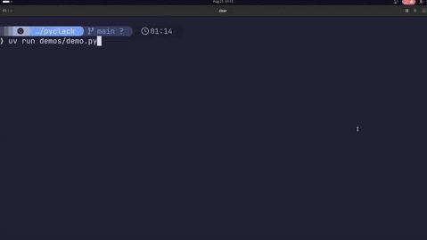

[](LICENSE)


# pyclack

**pyclack** is a Python port of [Clack](https://github.com/bombshell-dev/clack), the beautiful and minimal command-line prompt library for JavaScript, originally created by [Nate Moore (@natemoo-re)](https://github.com/natemoo-re).

pyclack brings Clack's interactive prompts, terminal UI components, and styling to Python while maintaining the same philosophy of providing a simple API for building beautiful command-line applications.

> [!NOTE]
> pyclack is an independent Python implementation inspired by Clack. It is not affiliated with or maintained by the Clack/Bombshell project.



I miss-spelled "writing" 😔, but I'm too lazy to re-record and edit this GIF again so deal with it...

# Features

- Interactive prompts for text input, multiline input, passwords, confirmations, selections, autocomplete, dates, and filesystem paths
- Synchronous and asynchronous APIs
- Animated spinners and progress bars
- Streaming output
- Task logging and semantic logging
- Intro, outro, cancellation, notes, and boxed messages
- Cross-platform terminal support for Windows, Linux, and macOS
- Terminal cursor, echo, and keyboard input control
- Customizable themes and symbols
- Reusable terminal rendering system
- Type-safe Python API with bundled type information

# Table of Contents

- [Installation & Setup](#installation--setup)
    - [Quick Start (Recommended)](#quick-start-recommended)
    - [Developer Installation & Local Development Build](#developer-installation--local-development-build)
- [Documentation](#documentation)
    - [`ClackOption`](#clackoption)
        - [Generic typing convention](#generic-typing-convention)
    - [Prompts](#prompts)
        - [Prompt overview](#prompt-overview)
        - [`ask()`](#ask)
        - [`password()`](#password)
        - [`confirm()`](#confirm)
        - [`pick_date()`](#pick_date)
        - [`multiline()`](#multiline)
        - [`select()`](#select)
        - [`multiselect()`](#multiselect)
        - [`autocomplete()`](#autocomplete)
        - [`autocomplete_multiselect()`](#autocomplete_multiselect)
        - [`select_key()`](#select_key)
        - [`select_path()`](#select_path)
        - [Cancellation](#cancellation)
            - [Cancellation values](#cancellation-values)
    - [Widgets](#widgets)
        - [`intro()`](#intro)
        - [`outro()`](#outro)
        - [`cancel()`](#cancel)
        - [`note()`](#note)
        - [`box()`](#box)
        - [`log`](#log)
        - [`TaskLog`](#tasklog)
            - [Adding messages](#adding-messages)
            - [Reading the log](#reading-the-log)
            - [Cancellation](#cancellation-1)
        - [`Spinner`](#spinner)
            - [Lifecycle](#lifecycle)
            - [Updating the message](#updating-the-message)
            - [Cancellation and errors](#cancellation-and-errors)
            - [Clearing](#clearing)
            - [Checking cancellation](#checking-cancellation)
        - [`Progress`](#progress)
            - [Basic lifecycle](#basic-lifecycle)
        - [`Activity`](#activity)
            - [Lifecycle](#lifecycle-1)
        - [`stream`](#stream)
            - [A normal iterable](#a-normal-iterable)
            - [An info stream](#an-info-stream)
            - [A step stream](#a-step-stream)
            - [An async iterable](#an-async-iterable)
    - [Asynchronous APIs](#asynchronous-apis)
    - [Themes](#themes)
        - [Custom themes](#custom-themes)
        - [Unicode and ASCII symbols](#unicode-and-ascii-symbols)
    - [Rendering](#rendering)
        - [`Text`](#text)
        - [`FrameBuilder`](#framebuilder)
        - [`RenderFrame`](#renderframe)
    - [Terminal](#terminal)
        - [`KeyReader`](#keyreader)
        - [`CursorController`](#cursorcontroller)
        - [`Stdout`](#stdout)
        - [`EchoController`](#echocontroller)
    - [Building a custom prompt](#building-a-custom-prompt)
        - [Custom prompt structure](#custom-prompt-structure)
        - [Validation](#validation)
        - [Propagating the key after an error](#propagating-the-key-after-an-error)
    - [Building a custom widget](#building-a-custom-widget)
    - [Custom component conventions](#custom-component-conventions)
        - [Prompts](#prompts-1)
        - [Widgets](#widgets-1)
        - [Themes](#themes-1)
    - [Example](#example)

# Installation & Setup

## Quick Start (Recommended)

The easiest way to get started with pyclack is via pip or uv. These methods will install the latest stable version directly into your active environment.

**Using pip:**  
```bash
pip install pyclack-lib
```

**Using uv** (recommended for fast virtual environment management):   
```bash
uv add pyclack-lib
```

### Developer Installation & Local Development Build

> **Prerequisites:**
> - uv (needed to manage project enviornment and to run the project)

If you are developing with the repository and need to test changes locally, follow these steps. This process uses uv sync to ensure your virtual environment is perfectly synchronized with the project's dependencies.

1). Clone the Repository:
```bash
git clone https://github.com/Maddox-RVS/pyclack.git
cd pyclack
```
2). Create and Sync Virtual Environment:
This command reads the project's dependency definitions in `pyproject.toml` and sets up a
pristine, isolated virtual environment based on those requirements.
```bash
uv sync --frozen
```
3). Run the Project:
You can now run the application using the local package installation:
```bash
uv run examples/my_pyclack_text_script.py
```

---

# Documentation
 
pyclack has two kinds of building blocks:
 
- **Prompts** collect input from the user and return a value.
- **Widgets** show output in the terminal and usually return `None`.
The synchronous API lives under `pyclack.prompts` and `pyclack.widgets`.
 
The asynchronous API lives under `pyclack.prompts_async` and `pyclack.widgets_async`.
 
---

# `ClackOption`
 
Every selection prompt uses `ClackOption`, a generic dataclass.
 
```python
from pyclack import ClackOption
 
option: ClackOption[str] = ClackOption[str](
    value='python',
    label='Python')
```
 
Its fields are:
 
```python
from pyclack import ClackOption
 
option: ClackOption[str] = ClackOption[str](
    value='python',
    label='Python',
    hint='Recommended',
    disabled=False)
```
 
- `value: V` - the value the option carries
- `label: str` - the text shown to the user
- `hint: str | None` - optional extra text next to the label
- `disabled: bool` - whether the user can select this option
## Generic typing convention
 
When you know the type of `value`, parameterize both the annotation and the constructor.
 
```python
from pyclack import ClackOption
 
integer_option: ClackOption[int] = ClackOption[int](
    value=3,
    label='Three')
```
 
For a `str` value:
 
```python
from pyclack import ClackOption
 
string_option: ClackOption[str] = ClackOption[str](
    value='python',
    label='Python')
```
 
For a custom type:
 
```python
from dataclasses import dataclass
 
from pyclack import ClackOption
 
@dataclass
class Language:
    name: str
    version: str
 
language: Language = Language(
    name='Python',
    version='3.13')
 
option: ClackOption[Language] = ClackOption[Language](
    value=language,
    label='Python 3.13')
```
 
---
 
# Prompts
 
A prompt blocks until the user submits, cancels, or its `abort_time` runs out.
 
A successful prompt returns the value described in its own section below.
 
A cancelled prompt raises `CancelException`. It does not return a special value for cancellation.
 
## Prompt overview
 
| Prompt | Purpose | Successful return |
| --- | --- | --- |
| `ask()` | Single-line text input | `str` |
| `password()` | Hidden text input | `str` |
| `confirm()` | Yes/no confirmation | `bool` |
| `pick_date()` | Date selection within a range | `date` |
| `multiline()` | Multi-line text input | `str` |
| `select()` | Single selection from options | `ClackOption[T]` |
| `multiselect()` | Multiple selection from options | `list[ClackOption[T]]` |
| `autocomplete()` | Filtered single selection | `ClackOption[T]` |
| `autocomplete_multiselect()` | Filtered multiple selection | `list[ClackOption[T]]` |
| `select_key()` | Selection by pressing a key | `ClackOption[str]` |
| `select_path()` | Filesystem path selection | `Path` |
 
Import any prompt from `pyclack.prompts`:
 
```python
from pyclack.prompts import ask, autocomplete, autocomplete_multiselect, confirm, multiline, multiselect, password, pick_date, select, select_key, select_path
```
 
## Common prompt options
 
Most prompts accept an `abort_time`, in seconds. When it runs out, the prompt cancels itself.
 
```python
from pyclack.prompts import ask
 
name: str = ask(
    message='What is your name?',
    abort_time=10.0)
```
 
Most prompts also accept a `validate` function.
 
```python
from pyclack.prompts import ask
 
def validate_name(value: str) -> str | None:
    if not value: return 'Name cannot be empty'
 
name: str = ask(
    message='What is your name?',
    validate=validate_name)
```
 
`validate` returns `None` when the value passes. It returns a `str` error message when the value fails.
 
---
 
# `ask()`
 
`ask()` collects one line of text.
 
### Input
 
```python
from pyclack.prompts import ask
 
name: str = ask(
    message='What is your name?',
    placeholder='(e.g. Bobby)')
```
 
Parameters:
 
- `message: str` - the prompt message
- `placeholder: str | None` - text shown when the input is empty
- `initial_value: str | None` - the starting text in the input
- `validate: Callable[[str], str | None] | None` - an optional validator
- `abort_time: float | None` - an optional timeout, in seconds
### Output
 
```python
from pyclack.prompts import ask
 
name: str = ask('What is your name?')
```
 
The return value is the entered `str`.
 
### Cancellation
 
`e.value` holds the text the user had typed at the time of cancellation.
 
```python
from pyclack.prompts import CancelException, ask
 
try:
    name: str = ask('What is your name?')
except CancelException as e:
    current_name: str | None = e.value
```
 
---
 
# `password()`
 
`password()` collects text and masks each character as the user types it.
 
### Input
 
```python
from pyclack.prompts import password
 
secret: str = password(
    message='Create a password',
    show_nothing=False)
```
 
Parameters:
 
- `message: str` - the prompt message
- `mask: Symbol | None` - a custom mask symbol
- `show_nothing: bool` - hide the entered characters completely, with no mask at all
- `clear_on_error: bool` - clear the input after a failed validation
- `validate: Callable[[str], str | None] | None` - an optional validator
- `abort_time: float | None` - an optional timeout, in seconds
The active theme sets the default mask symbol.
 
### Output
 
```python
from pyclack.prompts import password
 
secret: str = password('Create a password')
```
 
The return value is the entered `str`, in plain text. It is never the masked text.
 
### Cancellation
 
`e.value` holds the password text entered so far.
 
```python
from pyclack.prompts import CancelException, password
 
try:
    secret: str = password('Create a password')
except CancelException as e:
    current_secret: str | None = e.value
```
 
---
 
# `confirm()`
 
`confirm()` asks a yes/no question and returns a `bool`.
 
### Input
 
```python
from pyclack.prompts import confirm
 
confirmed: bool = confirm('Continue?')
```
 
Parameters:
 
- `message: str` - the prompt message
- `active: str` - the label for `True`
- `inactive: str` - the label for `False`
- `vertical: bool` - stack the two choices vertically instead of side by side
- `default_option: bool` - the option selected when the prompt opens
- `abort_time: float | None` - an optional timeout, in seconds
### Output
 
```python
from pyclack.prompts import confirm
 
confirmed: bool = confirm('Continue?')
```
 
The return value is `True` or `False`.
 
### Cancellation
 
`e.value` holds the option selected at the time of cancellation.
 
```python
from pyclack.prompts import CancelException, confirm
 
try:
    confirmed: bool = confirm('Continue?')
except CancelException as e:
    current_choice: bool | None = e.value
```
 
---
 
# `pick_date()`
 
`pick_date()` collects a date within a minimum and maximum bound.
 
### Input
 
```python
from datetime import date
 
from pyclack.prompts import pick_date
 
release_date: date = pick_date(
    message='Release date',
    initial_date=date.today(),
    min_date=date(2026, 1, 1),
    max_date=date(2030, 12, 31))
```
 
Parameters:
 
- `message: str` - the prompt message
- `initial_date: date` - the date the prompt starts on
- `min_date: date` - the earliest date the prompt accepts
- `max_date: date` - the latest date the prompt accepts
- `validate: Callable[[date], str | None] | None` - an optional validator
- `abort_time: float | None` - an optional timeout, in seconds
The user enters the date as `mm/dd/yyyy`.
 
### Output
 
```python
from datetime import date
 
from pyclack.prompts import pick_date
 
release_date: date = pick_date(
    'Release date',
    initial_date=date.today(),
    min_date=date(2026, 1, 1),
    max_date=date(2030, 12, 31))
```
 
The return value is a `datetime.date`.
 
### Cancellation
 
At cancellation, pyclack converts the current date fields to a `YYYY-MM-DD` string and stores that string in `e.value`.
 
```python
from datetime import date
 
from pyclack.prompts import CancelException, pick_date
 
try:
    release_date: date = pick_date(
        'Release date',
        initial_date=date.today(),
        min_date=date(2026, 1, 1),
        max_date=date(2030, 12, 31))
except CancelException as e:
    current_date: str | None = e.value
```
 
---
 
# `multiline()`
 
`multiline()` collects text that can span several lines.
 
### Input
 
```python
from pyclack.prompts import multiline
 
description: str = multiline(
    message='Description',
    placeholder='Enter a description...',
    show_submit=True)
```
 
Parameters:
 
- `message: str` - the prompt message
- `placeholder: str | None` - text shown when the input is empty
- `initial_value: str | None` - the starting text in the input
- `validate: Callable[[str], str | None] | None` - an optional validator
- `show_submit: bool` - show a submit button the user can move focus to
- `abort_time: float | None` - an optional timeout, in seconds
When `show_submit=False`, pressing Enter twice in a row submits the input.
 
When `show_submit=True`, Tab moves focus to the submit button, then Enter submits.
 
### Output
 
```python
from pyclack.prompts import multiline
 
description: str = multiline('Description')
```
 
The return value is a `str`. It keeps the newline characters the user typed.
 
### Cancellation
 
`e.value` holds the text entered so far.
 
```python
from pyclack.prompts import CancelException, multiline
 
try:
    description: str = multiline('Description')
except CancelException as e:
    current_description: str | None = e.value
```
 
---
 
# `select()`
 
`select()` lets the user choose exactly one option.
 
### Input
 
```python
from pyclack import ClackOption
from pyclack.prompts import select
 
options: list[ClackOption[str]] = [
    ClackOption[str](value='python', label='Python'),
    ClackOption[str](value='rust', label='Rust'),
    ClackOption[str](value='go', label='Go')]
 
selected: ClackOption[str] = select(
    message='Choose a language',
    options=options)
```
 
Parameters:
 
- `message: str` - the prompt message
- `options: list[ClackOption[T]]` - the list of options to choose from
- `show_instructions: bool` - show navigation instructions above the list
- `max_items: int` - the maximum number of option lines shown at once (the list scrolls past this)
- `abort_time: float | None` - an optional timeout, in seconds
`max_items` sets the size of the visible window into the option list. pyclack keeps this window at least 5 lines tall, even if you pass a smaller value.
 
### Output
 
The return value is the selected `ClackOption`, not its `.value`.
 
```python
from pyclack import ClackOption
from pyclack.prompts import select
 
options: list[ClackOption[int]] = [
    ClackOption[int](value=1, label='One'),
    ClackOption[int](value=2, label='Two'),
    ClackOption[int](value=3, label='Three')]
 
selected: ClackOption[int] = select(
    message='Choose a number',
    options=options)
 
number: int = selected.value
```
 
### Cancellation
 
`e.value` holds the option that was highlighted at the time of cancellation.
 
```python
from pyclack import CancelException, ClackOption
from pyclack.prompts import select
 
options: list[ClackOption[str]] = [
    ClackOption[str](value='python', label='Python'),
    ClackOption[str](value='rust', label='Rust')]
 
try:
    selected: ClackOption[str] = select(
        message='Language',
        options=options)
except CancelException as e:
    selected_before_cancel: ClackOption[str] | None = e.value
```
 
An empty option list, or an option list where every option is disabled, raises `RuntimeError`.
 
---
 
# `multiselect()`
 
`multiselect()` lets the user select more than one option.
 
### Input
 
```python
from pyclack import ClackOption
from pyclack.prompts import multiselect
 
options: list[ClackOption[str]] = [
    ClackOption[str](value='git', label='Git'),
    ClackOption[str](value='docker', label='Docker'),
    ClackOption[str](value='pytest', label='Pytest')]
 
selected: list[ClackOption[str]] = multiselect(
    message='Select tools',
    options=options)
```
 
Parameters:
 
- `message: str` - the prompt message
- `options: list[ClackOption[T]]` - the list of options to choose from
- `show_instructions: bool` - show navigation instructions above the list
- `max_items: int` - the maximum number of option lines shown at once (the list scrolls past this)
- `abort_time: float | None` - an optional timeout, in seconds
Space selects or deselects the focused option.
 
### Output
 
```python
from pyclack import ClackOption
from pyclack.prompts import multiselect
 
options: list[ClackOption[str]] = [
    ClackOption[str](value='git', label='Git'),
    ClackOption[str](value='docker', label='Docker')]
 
selected: list[ClackOption[str]] = multiselect(
    message='Select tools',
    options=options)
 
tools: list[str] = [option.value for option in selected]
```
 
### Cancellation
 
`e.value` holds the list of options selected so far. It is an empty list if nothing was selected yet.
 
```python
from pyclack import CancelException, ClackOption
from pyclack.prompts import multiselect
 
options: list[ClackOption[str]] = [
    ClackOption[str](value='git', label='Git'),
    ClackOption[str](value='docker', label='Docker')]
 
try:
    selected: list[ClackOption[str]] = multiselect(
        message='Select tools',
        options=options)
except CancelException as e:
    selected_before_cancel: list[ClackOption[str]] | None = e.value
```
 
An empty option list, or an option list where every option is disabled, raises `RuntimeError`.
 
---
 
# `autocomplete()`
 
`autocomplete()` adds text search on top of single-option selection.
 
### Input
 
```python
from pyclack import ClackOption
from pyclack.prompts import autocomplete
 
options: list[ClackOption[str]] = [
    ClackOption[str](value='python', label='Python'),
    ClackOption[str](value='rust', label='Rust'),
    ClackOption[str](value='javascript', label='JavaScript')]
 
selected: ClackOption[str] = autocomplete(
    message='Language',
    options=options,
    placeholder='Type to search...')
```
 
Parameters:
 
- `message: str` - the prompt message
- `options: list[ClackOption[T]]` - the list of options to choose from
- `placeholder: str` - text shown when the search input is empty
- `show_instructions: bool` - show navigation instructions above the list
- `max_items: int` - the maximum number of option lines shown at once (the list scrolls past this)
- `filter: Callable[[str, list[ClackOption[T]]], list[ClackOption[T]]] | None` - an optional custom search filter
- `abort_time: float | None` - an optional timeout, in seconds
When `filter=None`, pyclack uses its default filter.
 
A custom filter receives the current search text and the full option list, and returns the options to show.
 
```python
from pyclack import ClackOption
from pyclack.prompts import autocomplete
 
def filter_options(search: str, options: list[ClackOption[str]]) -> list[ClackOption[str]]:
    search_lower: str = search.lower()
    return [option for option in options if search_lower in option.label.lower()]
 
options: list[ClackOption[str]] = [
    ClackOption[str](value='python', label='Python'),
    ClackOption[str](value='rust', label='Rust')]
 
selected: ClackOption[str] = autocomplete(
    message='Language',
    options=options,
    filter=filter_options)
```
 
### Output
 
The return value is the selected `ClackOption`.
 
```python
from pyclack import ClackOption
from pyclack.prompts import autocomplete
 
options: list[ClackOption[int]] = [
    ClackOption[int](value=1, label='One'),
    ClackOption[int](value=2, label='Two')]
 
selected: ClackOption[int] = autocomplete(
    message='Number',
    options=options)
 
number: int = selected.value
```
 
### Cancellation
 
`e.value` holds the currently highlighted, enabled option. It is `None` when no option is usable.
 
```python
from pyclack import CancelException, ClackOption
from pyclack.prompts import autocomplete
 
options: list[ClackOption[str]] = [
    ClackOption[str](value='python', label='Python'),
    ClackOption[str](value='rust', label='Rust')]
 
try:
    selected: ClackOption[str] = autocomplete(
        message='Language',
        options=options)
except CancelException as e:
    selected_before_cancel: ClackOption[str] | None = e.value
```
 
An empty option list, or an option list where every option is disabled, raises `RuntimeError`.
 
---
 
# `autocomplete_multiselect()`
 
`autocomplete_multiselect()` adds text search on top of multiple selection.
 
### Input
 
```python
from pyclack import ClackOption
from pyclack.prompts import autocomplete_multiselect
 
options: list[ClackOption[str]] = [
    ClackOption[str](value='git', label='Git'),
    ClackOption[str](value='docker', label='Docker'),
    ClackOption[str](value='pytest', label='Pytest')]
 
selected: list[ClackOption[str]] = autocomplete_multiselect(
    message='Select tools',
    options=options)
```
 
Parameters:
 
- `message: str` - the prompt message
- `options: list[ClackOption[T]]` - the list of options to choose from
- `placeholder: str` - text shown when the search input is empty
- `show_instructions: bool` - show navigation instructions above the list
- `max_items: int` - the maximum number of option lines shown at once (the list scrolls past this)
- `filter: Callable[[str, list[ClackOption[T]]], list[ClackOption[T]]] | None` - an optional custom search filter
- `abort_time: float | None` - an optional timeout, in seconds
Space selects or deselects the highlighted option.
 
### Output
 
```python
from pyclack import ClackOption
from pyclack.prompts import autocomplete_multiselect
 
options: list[ClackOption[int]] = [
    ClackOption[int](value=1, label='One'),
    ClackOption[int](value=2, label='Two')]
 
selected: list[ClackOption[int]] = autocomplete_multiselect(
    message='Select numbers',
    options=options)
 
numbers: list[int] = [option.value for option in selected]
```
 
### Cancellation
 
`e.value` holds the list of options selected so far. It is an empty list if nothing was selected yet.
 
```python
from pyclack import CancelException, ClackOption
from pyclack.prompts import autocomplete_multiselect
 
options: list[ClackOption[str]] = [
    ClackOption[str](value='git', label='Git'),
    ClackOption[str](value='docker', label='Docker')]
 
try:
    selected: list[ClackOption[str]] = autocomplete_multiselect(
        message='Select tools',
        options=options)
except CancelException as e:
    selected_before_cancel: list[ClackOption[str]] | None = e.value
```
 
An empty option list, or an option list where every option is disabled, raises `RuntimeError`.
 
---
 
# `select_key()`
 
`select_key()` selects an option when the user presses its key.
 
Each option's `value` must be the key string that selects it.
 
### Input
 
```python
from pyclack import ClackOption
from pyclack.prompts import select_key
 
options: list[ClackOption[str]] = [
    ClackOption[str](value='y', label='Yes'),
    ClackOption[str](value='n', label='No'),
    ClackOption[str](value='s', label='Skip')]
 
selected: ClackOption[str] = select_key(
    'Choose an action',
    options=options,
    case_sensitive=True)
```
 
Parameters:
 
- `message: str` - the prompt message
- `options: list[ClackOption[str]]` - the list of options to choose from
- `case_sensitive: bool` - treat upper and lower case key presses as different keys
- `abort_time: float | None` - an optional timeout, in seconds
Pressing Enter selects the first option in the list.
 
### Output
 
```python
from pyclack import ClackOption
from pyclack.prompts import select_key
 
options: list[ClackOption[str]] = [
    ClackOption[str](value='y', label='Yes'),
    ClackOption[str](value='n', label='No')]
 
selected: ClackOption[str] = select_key(
    'Continue?',
    options=options)
 
key: str = selected.value
```
 
### Cancellation
 
`e.value` holds the first option in the list.
 
```python
from pyclack import CancelException, ClackOption
from pyclack.prompts import select_key
 
options: list[ClackOption[str]] = [
    ClackOption[str](value='y', label='Yes'),
    ClackOption[str](value='n', label='No')]
 
try:
    selected: ClackOption[str] = select_key(
        'Continue?',
        options=options)
except CancelException as e:
    default_option: ClackOption[str] | None = e.value
```
 
`select_key()` raises `RuntimeError` for an invalid or duplicate key value, an empty option list, or an option list where every option is disabled.
 
---
 
# `select_path()`
 
`select_path()` is an autocomplete-style filesystem picker.
 
### Input
 
```python
from pathlib import Path
 
from pyclack.prompts import select_path
 
selected_path: Path = select_path(
    message='Select a path',
    root=Path.cwd(),
    directory=False)
```
 
Parameters:
 
- `message: str` - the prompt message
- `placeholder: str` - text shown when the search input is empty
- `show_instructions: bool` - show navigation instructions above the list
- `max_items: int` - the maximum number of option lines shown at once (the list scrolls past this)
- `root: Path` - the directory the prompt starts in
- `directory: bool` - show only directories, not files
- `abort_time: float | None` - an optional timeout, in seconds
When `directory=False`, the prompt shows both files and directories.
 
When `directory=True`, the prompt shows only directories.
 
`root` defaults to the current working directory.
 
### Output
 
```python
from pathlib import Path
 
from pyclack.prompts import select_path
 
selected_path: Path = select_path('Select a file')
```
 
The return value is a `Path`.
 
If `root` does not exist, `select_path()` raises `FileNotFoundError`.
 
### Cancellation
 
`e.value` holds the currently selected `Path`. It is `None` when nothing is selected.
 
```python
from pathlib import Path
 
from pyclack import CancelException
from pyclack.prompts import select_path
 
try:
    selected_path: Path = select_path('Select a file')
except CancelException as e:
    selected_before_cancel: Path | None = e.value
```
 
---
 
# Cancellation
 
Cancellation works the same way across every prompt.
 
Escape or Ctrl+C cancels the active prompt. A prompt also cancels itself when its `abort_time` runs out.
 
The prompt raises `CancelException`:
 
```python
from pyclack import CancelException
from pyclack.prompts import ask
 
try:
    value: str = ask('Value')
except CancelException as e:
    current_value: str | None = e.value
```
 
`CancelException` is generic over the type of value it carries:
 
```python
from pyclack import CancelException
 
exception: CancelException[str] = CancelException('partial input')
```
 
Its `value` attribute holds whatever state the prompt chose to keep at the time of cancellation:
 
```python
from pyclack import CancelException
 
exception: CancelException[str] = CancelException('partial input')
 
value: str | None = exception.value
```
 
## Cancellation values
 
| Prompt | Successful return | `e.value` |
| --- | --- | --- |
| `ask()` | `str` | current `str`, or `None` |
| `password()` | `str` | current `str`, or `None` |
| `confirm()` | `bool` | current `bool`, or `None` |
| `pick_date()` | `date` | current date as a `YYYY-MM-DD` `str`, or `None` |
| `multiline()` | `str` | current `str`, or `None` |
| `select()` | `ClackOption[T]` | highlighted `ClackOption[T]`, or `None` |
| `multiselect()` | `list[ClackOption[T]]` | selected `list[ClackOption[T]]`, or `None` |
| `autocomplete()` | `ClackOption[T]` | highlighted `ClackOption[T]`, or `None` |
| `autocomplete_multiselect()` | `list[ClackOption[T]]` | selected `list[ClackOption[T]]`, or `None` |
| `select_key()` | `ClackOption[str]` | first option `ClackOption[str]`, or `None` |
| `select_path()` | `Path` | highlighted `Path`, or `None` |
 
The exception always signals cancellation. `e.value` always carries the useful partial state. This split stays the same across every prompt.
 
---
 
# Widgets
 
A widget shows terminal output. It does not collect a value from the user.
 
Import the synchronous widget API from `pyclack.widgets`:
 
```python
from pyclack.widgets import Activity, Progress, ProgressStyle, Spinner, TaskLog, box, cancel, intro, log, note, outro, stream
```
 
A simple widget, such as `intro()` or `note()`, returns `None` and has no state.
 
A stateful widget, such as `Spinner`, `Progress`, `Activity`, and `TaskLog`, is an object. Its methods control what it shows and when.
 
---
 
# `intro()`
 
`intro()` shows an introductory message.
 
```python
from pyclack.widgets import intro
 
intro('My Application')
```
 
Parameters:
 
- `title: str` - the title to show
- `custom_style: Style | None` - an optional style override for the title
---
 
# `outro()`
 
`outro()` shows a closing message.
 
```python
from pyclack.widgets import outro
 
outro('Done!')
```
 
Parameters:
 
- `message: str` - the message to show
- `custom_style: Style | None` - an optional style override for the message
---
 
# `cancel()`
 
`cancel()` shows a cancellation message.
 
```python
from pyclack.widgets import cancel
 
cancel('Operation cancelled.')
```
 
Parameters:
 
- `message: str` - the cancellation message to show
---
 
# `note()`
 
`note()` shows a titled note.
 
```python
from pyclack.widgets import note
 
note('Configuration', 'Using configuration from pyproject.toml.')
```
 
Parameters:
 
- `title: str` - the note's title
- `message: str` - the text inside the note
---
 
# `box()`
 
`box()` shows text inside a bordered box.
 
```python
from pyclack import Alignment
from pyclack.widgets import box
 
box(
    'Build complete.',
    'Status',
    content_align=Alignment.CENTER,
    title_align=Alignment.LEFT,
    rounded=True)
```
 
Parameters:
 
- `content: str` - the text inside the box
- `title: str` - the box's title
- `content_align: Alignment` - the alignment of the content
- `title_align: Alignment` - the alignment of the title
- `width: int | None` - the box's maximum width in the terminal, or `None` for no maximum
- `rounded: bool` - use rounded corners
- `title_padding: int` - the spacing on each side of the title
- `content_padding: int` - the spacing on each side of the content
---
 
# `log`
 
`log` shows one-off messages at different severity levels.
 
```python
from pyclack.widgets import log
 
log.message('Starting build')
log.info('Using Python 3.13')
log.warning('Configuration file not found')
log.error('Compilation failed')
log.success('Build complete')
log.step('Installing dependencies')
```
 
Each function takes one argument:
 
- `msg: str` - the message to show

The available levels are:
 
- `message()`
- `info()`
- `warning()`
- `warn()`
- `error()`
- `success()`
- `step()`

`warn()` is an alias for `warning()`.
 
---
 
# `TaskLog`
 
`TaskLog` shows a running task and the messages it produces while it works.
 
### Input
 
```python
from pyclack.widgets import TaskLog
 
task: TaskLog = TaskLog(
    title='Building project',
    limit=5,
    retain_log=False)
```
 
Parameters:
 
- `title: str` - the title shown above the log
- `limit: int | None` - the maximum number of messages kept and shown at once
- `retain_log: bool` - keep the full log instead of trimming it to `limit`
### Adding messages
 
```python
from pyclack.widgets import TaskLog
 
task: TaskLog = TaskLog(title='Building')
 
task.message('Compiling main.py')
task.message('Compiling utils.py')
task.success('Build complete')
```
 
Once `success()` runs, the task is marked done. Later calls to `message()` have no effect.
 
### Reading the log
 
```python
from pyclack.widgets import TaskLog
 
task: TaskLog = TaskLog(title='Building')
 
task.message('Compiling')
task.message('Linking')
 
messages: list[str] = task.get_log()
```
 
The stored log includes the initial title as its first entry.
 
### Cancellation
 
Ctrl+C while a `TaskLog` is active raises `CancelException`, with no value attached.
 
```python
from pyclack import CancelException
from pyclack.widgets import TaskLog, cancel
 
task: TaskLog = TaskLog(title='Building')
 
try:
    task.message('Compiling')
    # ... do some work ...
except CancelException:
    cancel('Compiling cancelled!')
    exit(0)
```
 
---
 
# `Spinner`
 
`Spinner` shows an animated spinner while work runs.
 
### Input
 
```python
from pyclack.widgets import Spinner
 
spinner: Spinner = Spinner(
    show_timer=False,
    show_elipse=True,
    spinner_delay=80,
    elipse_delay=500)
```
 
Parameters:
 
- `show_timer: bool` - show elapsed time since the spinner started
- `show_elipse: bool` - show an animated ellipsis after the message
- `spinner_delay: float` - milliseconds between spinner frames
- `elipse_delay: float` - milliseconds between ellipsis frames
- `spinner_frames: SpinnerSymbols | None` - a custom set of spinner frames, or `None` to use the active theme's set
### Lifecycle
 
```python
from pyclack.widgets import Spinner
 
spinner: Spinner = Spinner()
 
spinner.start('Installing dependencies')
# ... do some work ...
spinner.stop('Dependencies installed')
```
 
### Updating the message
 
```python
from pyclack.widgets import Spinner
 
spinner: Spinner = Spinner()
 
spinner.start('Installing')
# ... do some work ...
spinner.set_message('Installing package 2/5')
```
 
### Cancellation and errors
 
```python
from pyclack.widgets import Spinner
 
spinner: Spinner = Spinner()
 
spinner.start('Installing')
# ... do some interrupted work ...
spinner.cancel('Installation cancelled')
```
 
```python
from pyclack.widgets import Spinner
 
spinner: Spinner = Spinner()
 
spinner.start('Installing')
# ... do some failed work ...
spinner.error('Installation failed')
```
 
### Clearing
 
```python
from pyclack.widgets import Spinner
 
spinner: Spinner = Spinner()
 
spinner.start('Installing')
# ... do some work ...
spinner.clear()
```
 
### Checking cancellation
 
```python
from pyclack.widgets import Spinner
 
spinner: Spinner = Spinner()
 
cancelled: bool = spinner.is_cancelled()
```
 
Ctrl+C raises `CancelException` while the spinner runs. The spinner restores the terminal state during cleanup either way.
 
```python
from pyclack import CancelException
from pyclack.widgets import Spinner, cancel
 
spinner: Spinner = Spinner()
 
spinner.start('Installing')
try:
    pass # ... do some work ...
except CancelException:
    spinner.cancel('Installation cancelled')
    cancel('Operation cancelled')
    exit(0)
spinner.stop('Dependencies installed')
```
 
---
 
# `Progress`
 
`Progress` shows a progress bar, with an optional spinner, ellipsis, and timer.
 
### Input
 
```python
from pyclack.widgets import Progress, ProgressStyle
 
progress: Progress = Progress(
    max=100,
    size=30,
    style=ProgressStyle.HEAVY,
    show_timer=False,
    show_elipse=True)
```
 
Parameters:
 
- `max: int` - the progress value that means "done"
- `size: int` - the bar's width, in characters
- `style: ProgressStyle` - `LIGHT`, `HEAVY`, or `BLOCK`
- `show_timer: bool` - show elapsed time since the bar started
- `show_elipse: bool` - show an animated ellipsis after the message
- `spinner_delay: float` - milliseconds between spinner frames
- `elipse_delay: float` - milliseconds between ellipsis frames
- `spinner_frames: SpinnerSymbols | None` - a custom set of spinner frames, or `None` to use the active theme's set
### Basic lifecycle
 
```python
from pyclack.widgets import Progress
 
progress: Progress = Progress(max=100, size=30)
 
progress.start('Downloading')
 
progress.advance(25)
progress.advance(25)
 
progress.stop('Download complete')
```
 
`Progress` also supports:
 
```python
progress.error('Download failed')
progress.clear()
cancelled: bool = progress.is_cancelled()
```
 
`Progress` is stateful. It keeps its current value and redraws its own frame as that value changes.
 
Ctrl+C raises `CancelException` while the bar runs. The bar restores the terminal state during cleanup either way.
 
```python
from pyclack import CancelException, cancel
from pyclack.widgets import Progress
 
progress: Progress = Progress(max=100, size=30)
 
progress.start('Downloading')
try:
    for i in range(100):
        progress.advance()
except CancelException:
    progress.cancel('Download cancelled')
    cancel('Operation cancelled')
    exit(0)
progress.stop('Download complete')
```
 
---
 
# `Activity`
 
`Activity` pairs a spinner with a running log of activity messages.
 
### Input
 
```python
from pyclack.widgets import Activity
 
activity: Activity = Activity(
    limit=5,
    show_timer=False,
    show_elipse=True)
```
 
Parameters:
 
- `limit: int | None` - the maximum number of messages kept and shown at once
- `show_timer: bool` - show elapsed time since the activity started
- `show_elipse: bool` - show an animated ellipsis after the spinner message
- `spinner_delay: float` - milliseconds between spinner frames
- `elipse_delay: float` - milliseconds between ellipsis frames
- `spinner_frames: SpinnerSymbols | None` - a custom set of spinner frames, or `None` to use the active theme's set
### Lifecycle
 
```python
from pyclack.widgets import Activity
 
activity: Activity = Activity()
 
activity.start('Building')
activity.set_activity_message('Compiling main.py')
activity.set_activity_message('Compiling utils.py')
activity.stop('Build complete')
```
 
The activity message and the spinner message are separate pieces of state.
 
```python
from pyclack.widgets import Activity
 
activity: Activity = Activity()
 
activity.start('Building')
activity.set_spinner_message('Still building')
activity.set_activity_message('Compiling main.py')
 
current_activity: str = activity.get_activity_message()
```
 
`Activity` also supports:
 
```python
activity.cancel('Build cancelled')
activity.error('Build failed')
activity.clear()
cancelled: bool = activity.is_cancelled()
```
 
---
 
# `stream`
 
`stream` is for output where the number of messages is not known ahead of time.
 
Unlike the other widgets, `stream` accepts an `Iterable[str]` or an `AsyncIterable[str]` directly, and shows each item as it arrives.
 
```python
from pyclack.widgets import stream
 
messages: list[str] = ['Downloading...', 'Extracting...', 'Installing...', 'Complete']
 
stream.message(messages)
```
 
The three stream levels are:
 
- `stream.message()`
- `stream.info()`
- `stream.step()`
### A normal iterable
 
```python
from collections.abc import Iterator
 
from pyclack.widgets import stream
 
def messages() -> Iterator[str]:
    yield 'Downloading...'
    yield 'Extracting...'
    yield 'Installing...'
    yield 'Complete'
 
stream.message(messages())
```
 
### An info stream
 
```python
from collections.abc import Iterator
 
from pyclack.widgets import stream
 
def messages() -> Iterator[str]:
    yield 'Connected'
    yield 'Downloading'
    yield 'Complete'
 
stream.info(messages())
```
 
### A step stream
 
```python
from collections.abc import Iterator
 
from pyclack.widgets import stream
 
def steps() -> Iterator[str]:
    yield 'Installing dependencies'
    yield 'Building project'
    yield 'Running tests'
 
stream.step(steps())
```
 
### An async iterable
 
```python
from collections.abc import AsyncIterator
 
from pyclack.widgets import stream
 
async def messages() -> AsyncIterator[str]:
    yield 'Connecting...'
    yield 'Downloading...'
    yield 'Complete'
 
stream.message(messages())
```
 
`stream.message()`, `stream.info()`, and `stream.step()` all accept the same type:
 
```python
from collections.abc import AsyncIterable, Iterable
 
values: Iterable[str] | AsyncIterable[str]
```
 
Every stream function blocks until its iterable runs out of items.
 
---
 
# Asynchronous APIs
 
pyclack provides asynchronous wrappers for every prompt, under `pyclack.prompts_async`.
 
```python
from pyclack.prompts_async import ask
 
async def get_name() -> str:
    name: str = await ask('Name')
    return name
```
 
Each wrapper keeps the same behavior and return type as its synchronous counterpart.
 
A wrapper runs the synchronous prompt in a worker thread, through `asyncio.to_thread()`. This lets you `await` the prompt without blocking the event loop.
 
Every prompt has a wrapper:
 
```python
from pyclack.prompts_async import ask, autocomplete, autocomplete_multiselect, confirm, multiline, multiselect, password, pick_date, select, select_key, select_path
```
 
The widget wrappers live under `pyclack.widgets_async`:
 
```python
from pyclack.widgets_async import Activity, Progress, Spinner, TaskLog, box, cancel, intro, note, outro, stream, log
```
 
The async widget wrappers also delegate through `asyncio.to_thread()`. For example:
 
```python
from pyclack.widgets_async import Spinner
 
async def build() -> None:
    spinner: Spinner = Spinner()
 
    await spinner.start('Building')
    await do_async_build()
    await spinner.stop('Build complete')
```
 
---
 
# Themes
 
A theme sets the colors and symbols every prompt and widget uses.
 
A `Theme` holds:
 
- an `active` style
- a `submit` style
- a `cancel` style
- an `error` style
- an `info` style
- a `muted` style
- a `text` style
- a `cursor` style
- a `Symbols` object
`Theme` defines one theme. `Themes` collects the built-in themes.
 
Change the active theme with `set_active_theme()`:
 
```python
from pyclack import Themes, set_active_theme
 
set_active_theme(Themes.DEFAULT)
```
 
Read the active theme with `get_active_theme()`:
 
```python
from pyclack import get_active_theme
 
theme = get_active_theme()
```
 
The theme system stays separate from the prompt and widget code. A prompt or widget asks the active theme for its colors and symbols each time it renders.
 
This means switching the active theme changes how every prompt and widget looks, without changing a single line of their rendering code.
 
## Custom themes
 
Build a `Theme` from `Style`, `Symbols`, `Symbol`, and `SpinnerSymbols`.
 
```python
from pyclack import set_active_theme
from pyclack.renderer import SpinnerSymbols, Style, Symbol, Symbols, Theme
 
custom_theme: Theme = Theme(
    active=Style(fg_color='cyan'),
    submit=Style(fg_color='green'),
    cancel=Style(fg_color='red'),
    error=Style(fg_color='yellow'),
    info=Style(fg_color='blue'),
    muted=Style(fg_color='bright_black'),
    text=Style(fg_color='white'),
    cursor=Style(fg_color='bright_black', bg_color='white'),
    symbols=Symbols(
        step_marker_active=Symbol('◆', '*'),
        step_marker_cancel=Symbol('■', 'x'),
        step_marker_error=Symbol('▲', 'x'),
        step_marker_submit=Symbol('◇', 'o'),
        connector_bar_start=Symbol('┌', 'T'),
        connector_bar_vertical=Symbol('│', '|'),
        connector_bar_end=Symbol('└', '-'),
        selection_widget_radio_active=Symbol('●', '>'),
        selection_widget_radio_inactive=Symbol('○', ' '),
        selection_widget_checkbox_active=Symbol('◻', '[•]'),
        selection_widget_checkbox_selected=Symbol('◼', '[+]'),
        selection_widget_checkbox_inactive=Symbol('◻', '[ ]'),
        selection_widget_password_mask=Symbol('▪', '*'),
        box_drawing_horizontal_bar=Symbol('─', '-'),
        box_drawing_vertical_bar=Symbol('│', '|'),
        box_drawing_top_right_corner_rounded=Symbol('╮', '+'),
        box_drawing_left_connector=Symbol('├', '+'),
        box_drawing_bottom_right_corner_rounded=Symbol('╯', '+'),
        box_drawing_top_left_corner_rounded=Symbol('╭', '+'),
        box_drawing_bottom_left_corner_rounded=Symbol('╰', '+'),
        box_drawing_top_right_corner=Symbol('┐', '+'),
        box_drawing_bottom_right_corner=Symbol('┘', '+'),
        box_drawing_top_left_corner=Symbol('┌', '+'),
        box_drawing_bottom_left_corner=Symbol('└', '+'),
        log_level_info=Symbol('●', 'i'),
        log_level_success=Symbol('◆', '*'),
        log_level_warn=Symbol('▲', '!'),
        log_level_error=Symbol('■', 'x'),
        spinner=SpinnerSymbols(
            unicode_symbols=('◒', '◐', '◓', '◑'),
            ascii_symbols=('|', '/', '-', '\\')),
        progress_light=Symbol('─', '-'),
        progress_heavy=Symbol('━', '='),
        progress_block=Symbol('█', '#')))
 
set_active_theme(custom_theme)
```
 
The repository ships more than 30 built-in themes, each with its own colors and symbols. See `demos/demo.py` for the full list of names under `Themes`.
 
## Unicode and ASCII symbols
 
Every `Symbol` holds a Unicode form and an ASCII fallback.
 
```python
from pyclack.renderer import Symbol
 
marker: Symbol = Symbol('◆', '*')
```
 
The renderer picks whichever form fits the current terminal.
 
Force ASCII-only output with:
 
```python
from pyclack import set_print_mode_ascii
 
set_print_mode_ascii()
```
 
---
 
# Rendering
 
The rendering system lives under `pyclack.renderer`.
 
```python
from pyclack.renderer import FrameBuilder, RenderFrame, SpinnerSymbols, Style, Symbol, Symbols, Text, Theme, Themes
```
 
The rendering model has four steps:
 
1. Build `Text` objects.
2. Add them to a `FrameBuilder`.
3. Build the frame.
4. Draw it with `RenderFrame`.
## `Text`
 
`Text` pairs terminal text with an optional style.
 
```python
from pyclack.renderer import Style, Text
 
style: Style = Style(fg_color='cyan', bold=True)
 
text: Text = Text('Hello', style)
```
 
You can combine `Text` objects to build more complex output.
 
## `FrameBuilder`
 
`FrameBuilder` collects the lines that make up one frame.
 
```python
from pyclack.renderer import FrameBuilder, Text
 
builder: FrameBuilder = FrameBuilder()
 
builder.add_line(Text('First line'))
builder.add_line(Text('Second line'))
 
frame: tuple[Text, ...] = builder.build()
```
 
Use `add_lines()` to add more than one line at once.
 
```python
from pyclack.renderer import FrameBuilder, Text
 
builder: FrameBuilder = FrameBuilder()
 
builder.add_lines(
    Text('First'),
    Text('Second'),
    Text('Third'))
 
frame: tuple[Text, ...] = builder.build()
```
 
## `RenderFrame`
 
`RenderFrame` owns the frame currently on screen.
 
When you draw a new frame, `RenderFrame` clears the old one first.
 
```python
from pyclack.renderer import RenderFrame, Text
 
render_frame: RenderFrame = RenderFrame()
 
render_frame.draw_frame(Text('Loading...'))
```
 
Clear a frame directly with:
 
```python
from pyclack.renderer import RenderFrame, Text
 
render_frame: RenderFrame = RenderFrame()
 
render_frame.draw_frame(Text('Loading...'))
render_frame.clear_frame()
```
 
This frame model lets a spinner, a prompt, or a progress bar redraw itself in place, instead of printing a new line every time it updates.
 
---
 
# Terminal
 
The terminal subsystem lives under `pyclack.terminal`.
 
```python
from pyclack.terminal import CursorController, EchoController, KeyReader, Stdout
```
 
It gives prompts and widgets the low-level terminal operations they need.
 
## `KeyReader`
 
`KeyReader` reads one key at a time, instead of waiting for a full line of input.
 
A custom component should use `KeyReader` instead of reading `stdin` directly.
 
## `CursorController`
 
`CursorController` builds the escape sequences that hide the cursor, show the cursor, and move or clear rendered lines.
 
```python
from pyclack.terminal import CursorController
 
hide_sequence: str = CursorController.hide_cursor()
show_sequence: str = CursorController.show_cursor()
```
 
## `Stdout`
 
`Stdout` is the output abstraction every pyclack component writes through.
 
A custom widget should use `Stdout` instead of calling `print()` directly inside its rendering code.
 
## `EchoController`
 
`EchoController` turns terminal echo on and off for interactive components.
 
This matters most for a prompt that needs to control how a keypress, such as Ctrl+C, appears on screen.
 
A custom interactive component should use the existing terminal controllers, instead of writing its own platform-specific terminal code.
 
---
 
# Building a custom prompt
 
If none of the built-in prompts fit your use case, subclass `PromptBase`. It gives your prompt the same state machine and rendering conventions the built-in prompts use.
 
A prompt moves through five states:
 
```python
from pyclack.prompts import PromptState
 
initial: PromptState = PromptState.INITIAL
active: PromptState = PromptState.ACTIVE
submit: PromptState = PromptState.SUBMIT
cancel: PromptState = PromptState.CANCEL
error: PromptState = PromptState.ERROR
```
 
The normal flow is:
 
```text
INITIAL
   |
   v
ACTIVE <----+
   |        |
   v        |
SUBMIT      |
   |        |
   +-- error
   |
   v
EXIT
 
ACTIVE/ERROR
   |
   +----> CANCEL
```
 
`PromptBase` runs the state machine. Your subclass supplies the behavior for each state.
 
## Custom prompt structure
 
A custom prompt should:
 
1. Subclass `PromptBase`.
2. Store its input state on the prompt instance.
3. Create a `RenderFrame`.
4. Implement `handle_active()`.
5. Implement `handle_submit()`.
6. Implement `handle_error()`, if the prompt needs validation.
7. Implement `handle_cancel()`.
8. Raise `CancelException` from `handle_cancel()`.
9. Render each state through `FrameBuilder`, `Text`, the active `Theme`, and `RenderFrame`.
10. Expose a small public function that builds the prompt and returns its final value.
A minimal prompt looks like this:
 
```python
from typing import override
 
from pyclack.prompts import CancelException, PromptBase
from pyclack.renderer import FrameBuilder, RenderFrame, Text
 
class CustomPrompt(PromptBase):
    def __init__(self, message: str) -> None:
        super().__init__()
 
        self.message: str = message
        self.value: str = ''
        self.render_frame: RenderFrame = RenderFrame()
 
        self.activate()
 
    @override
    def handle_active(self, key: str | None) -> bool:
        frame_builder: FrameBuilder = FrameBuilder()
        frame_builder.add_line(Text(self.message))
        frame_builder.add_line(Text(self.value))
 
        frame: tuple[Text, ...] = frame_builder.build()
        self.render_frame.draw_frame(*frame)
 
        if key == 'ENTER': return True
        if key: self.value += key
        return False
 
    @override
    def handle_submit(self) -> bool:
        return True
 
    @override
    def handle_cancel(self) -> None:
        raise CancelException[str](self.value)
```
 
Then expose it through a small function:
 
```python
from pyclack.prompts import CancelException
 
def custom_prompt(message: str) -> str:
    prompt: CustomPrompt = CustomPrompt(message)
    return prompt.value
```
 
A real prompt's rendering is usually more involved than this. The convention that matters is: the prompt owns its state, and `PromptBase` owns the state machine.
 
## Validation
 
When the prompt can enter an invalid state, `handle_submit()` should return `False`.
 
Returning `False` sends the prompt into `handle_error()`.
 
```python
from typing import override
 
from pyclack.prompts import PromptBase
 
class ValidatedPrompt(PromptBase):
    @override
    def handle_submit(self) -> bool:
        return self._is_valid()
```
 
`handle_error()` renders the error state, then returns one of:
 
- `False`, to stay in the error state
- `True`, to return to the active state
`PromptBase` handles the state change either way.
 
## Propagating the key after an error
 
A prompt that wants the key that clears an error to also act as the next active-state key can set:
 
```python
from pyclack.prompts import PromptBase
 
class CustomPrompt(PromptBase):
    def __init__(self) -> None:
        super().__init__()
 
        self.propagate_key_after_error: bool = True
```
 
---
 
# Building a custom widget
 
A widget does not use the prompt state machine.
 
A custom widget owns its own rendering state directly, and uses `RenderFrame` to redraw it.
 
A minimal stateful widget looks like this:
 
```python
from pyclack.renderer import FrameBuilder, RenderFrame, Text
 
class CustomWidget:
    def __init__(self) -> None:
        self.render_frame: RenderFrame = RenderFrame()
        self.message: str = ''
 
    def start(self, message: str) -> None:
        self.message = message
        self._render()
 
    def set_message(self, message: str) -> None:
        self.message = message
        self._render()
 
    def clear(self) -> None:
        self.render_frame.clear_frame()
 
    def _render(self) -> None:
        frame_builder: FrameBuilder = FrameBuilder()
        frame_builder.add_line(Text(self.message))
 
        frame: tuple[Text, ...] = frame_builder.build()
        self.render_frame.draw_frame(*frame)
```
 
A real pyclack widget pulls its style from the active theme, instead of hard-coding it:
 
```python
from pyclack import get_active_theme
from pyclack.renderer import FrameBuilder, RenderFrame, Text
 
class ThemedWidget:
    def __init__(self) -> None:
        self.render_frame: RenderFrame = RenderFrame()
 
    def render(self, message: str) -> None:
        theme = get_active_theme()
 
        frame_builder: FrameBuilder = FrameBuilder()
        frame_builder.add_line(Text(message, theme.text))
 
        frame: tuple[Text, ...] = frame_builder.build()
        self.render_frame.draw_frame(*frame)
```
 
This keeps the widget correct under every active theme.

Some widgets take time to render, what if the user presses Ctrl+C during that? `CancelException` should be raised. pyclack does this be swapping the hander that runs when a `SIGINT` is raised by a Ctrl+C press.

This is usually run at the start of the pyclack widget:
```python
import signal
from pyclack import CancelException

old_sigint_handler = signal.getsignal(signal.SIGINT)
def handle_interrupt(signum, frame) -> None:
    signal.signal(signal.SIGINT, old_sigint_handler) # resets back to old handler if cancelled
    raise CancelException
signal.signal(signal.SIGINT, handle_interrupt)
```

At the end of the pyclack widget the handler is reset:
```python
signal.signal(signal.SIGINT, old_sigint_handler)
```
 
---
 
# Custom component conventions
 
When you extend pyclack, follow the same pattern as the built-in components.
 
### Prompts
 
- Subclass `PromptBase`.
- Keep interactive state on the prompt instance.
- Drive the prompt through `PromptState`, using the base state machine, instead of writing a separate input loop.
- Render every state through `RenderFrame`.
- Build output with `Text` and `FrameBuilder`.
- Pull colors and symbols from `get_active_theme()`.
- Signal cancellation through `CancelException`.
- Put useful partial state in `CancelException.value`.
- Support `abort_time` when the prompt should be able to cancel itself.
- Expose one small public function that returns the prompt's final value.
### Widgets
 
- Do not subclass `PromptBase`.
- Own the widget's state directly.
- Set own custom Ctrl+C handler.
- Use `RenderFrame` for output that redraws in place.
- Build frames with `FrameBuilder` and `Text`.
- Pull visual properties from the active theme.
- Use `Stdout` and the terminal controllers for terminal changes.
- Restore old handler, cursor, and echo state when the widget finishes or is cancelled.
### Themes
 
- Never hard-code a color or symbol that belongs in the theme.
- Use `Style` for styles.
- Use `Symbol` for individual symbols.
- Use `SpinnerSymbols` for animated spinner frames.
- Provide both a Unicode form and an ASCII fallback where one applies.
This separation lets pyclack change its whole appearance without touching a single prompt or widget's code.
 
---
 
# Example
 
This small script combines a few prompts and widgets. It follows the same style as `demos/demo.py`, which covers every prompt and widget in the package.
 
```python
from pyclack import CancelException, ClackOption
from pyclack.prompts import ask, select
from pyclack.widgets import intro, outro, cancel
 
def main() -> None:
    intro('Example')
 
    try:
        name: str = ask('What is your name?')
 
        languages: list[ClackOption[str]] = [
            ClackOption[str](value='python', label='Python'),
            ClackOption[str](value='rust', label='Rust')]
 
        language: ClackOption[str] = select(
            'Favorite language',
            options=languages)
    except CancelException:
        cancel('Operation cancelled.')
        exit(0)

    outro(f'Hello {name}! You chose {language.value}.')
 
if __name__ == '__main__':
    main()
```
 
Run the full demo with:
 
```bash
uv run demos/demo.py
```
 
The pattern behind every piece of pyclack stays the same:
 
```text
prompt          -> value
widget          -> terminal output
cancel          -> CancelException
partial state   -> e.value
selection       -> ClackOption[T]
theme           -> active Theme
custom prompt   -> PromptBase
custom widget   -> RenderFrame
```
 
That is the core of pyclack.